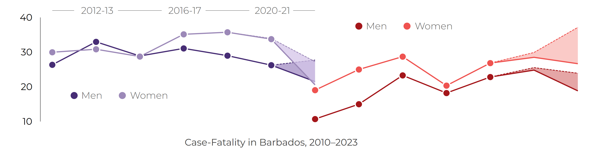

<!--
MAINTENANCE NOTE — updating this HTML page to a later approved briefing release

The current HTML page uses the approved 2023 v1 package:
  cvd_case_fatality_2023_v1

When a later product is published, update the package ID consistently in:
  1. the shared-snippet include paths near the top of this file;
  2. every figure path and full-size figure link;
  3. the workbook link and filename; and
  4. the ZIP package link and filename.

Use the website mirror under:
  ../../../downloads/files/briefings/{package_id}/

Do not link this HTML page to private staging or to the authoritative
outputs/public location. Update the visible year, headline values, narrative,
and citation separately when the new analytical release requires it. The PDF
and reveal.js links are maintained in their separate pages and should be
updated in that later workflow.
-->

::: {.bnr-utility-card .bnr-briefing-action-card .my-3}

### View other formats

Use the slide deck for meetings, teaching, or stakeholder briefings. The PDF version is designed for printing, sharing, and citation.

::: {.bnr-utility-links}
[Open PDF briefing](pdf/bnr_cvd_case_fatality_2023_v1.pdf){.btn .btn-outline-primary target="_blank" rel="noopener"}
[Open presentation slides](slides/bnr_cvd_case_fatality_2023_v1_slides.html){.btn .btn-outline-primary target="_blank" rel="noopener"}
:::

:::






This briefing focuses on three questions:

::: {.grid}

::: {.g-col-12 .g-col-md-4}
::: {.card .border-0 .shadow-sm .h-100 .bg-light}
::: {.card-body}

### How high is case fatality?

What proportion of hospital-registered strokes and heart attacks resulted in death?

:::
:::
:::

::: {.g-col-12 .g-col-md-4}
::: {.card .border-0 .shadow-sm .h-100 .bg-light}
::: {.card-body}

### Has case fatality changed?

How did case fatality change between 2012–2013 and 2022–2023?

:::
:::
:::

::: {.g-col-12 .g-col-md-4}
::: {.card .border-0 .shadow-sm .h-100 .bg-light}
::: {.card-body}

### Are patterns different by sex?

How do case-fatality patterns differ between women and men, and between strokes and heart attacks?

:::
:::
:::

:::


## Headline findings

Confirmed in-hospital case fatality, 2022–2023.

::: {.grid .mb-4}

::: {.g-col-6 .g-col-md-3}
::: {.card .border-0 .shadow-sm .h-100 .bg-light}
::: {.card-body .text-center .p-3}

<p class="text-uppercase fw-semibold small text-muted mb-1">Women</p>
<p class="text-uppercase fw-semibold small text-muted mb-1">Stroke</p>
<p class="display-6 fw-semibold mb-1">21%</p>
<p class="mb-0 small">case fatality</p>

:::
:::
:::

::: {.g-col-6 .g-col-md-3}
::: {.card .border-0 .shadow-sm .h-100 .bg-light}
::: {.card-body .text-center .p-3}

<p class="text-uppercase fw-semibold small text-muted mb-1">Men</p>
<p class="text-uppercase fw-semibold small text-muted mb-1">Stroke</p>
<p class="display-6 fw-semibold mb-1">22%</p>
<p class="mb-0 small">case fatality</p>

:::
:::
:::

::: {.g-col-6 .g-col-md-3}
::: {.card .border-0 .shadow-sm .h-100 .bg-light}
::: {.card-body .text-center .p-3}

<p class="text-uppercase fw-semibold small text-muted mb-1">Women</p>
<p class="text-uppercase fw-semibold small text-muted mb-1">Heart attack</p>
<p class="display-6 fw-semibold mb-1">27%</p>
<p class="mb-0 small">case fatality</p>

:::
:::
:::

::: {.g-col-6 .g-col-md-3}
::: {.card .border-0 .shadow-sm .h-100 .bg-light}
::: {.card-body .text-center .p-3}

<p class="text-uppercase fw-semibold small text-muted mb-1">Men</p>
<p class="text-uppercase fw-semibold small text-muted mb-1">Heart attack</p>
<p class="display-6 fw-semibold mb-1">19%</p>
<p class="mb-0 small">case fatality</p>

:::
:::
:::

:::


## CVD Case fatality

```{=html}
<p class="mt-3 mb-2" style="font-size: 1.15rem; font-weight: 700;">
  Confirmed case-fatality patterns differ by
  <span style="color: rgb(164, 22, 26);">event type</span>
  and
  <span style="color: rgb(139, 111, 180);">sex</span>
</p>
```

::: {.card .border-0 .shadow-sm .mb-4}
::: {.card-body}

{fig-alt="Line chart showing confirmed case-fatality percentages and an uncertainty region for probable deaths from 2010 to 2023." width="100%"}

[Open full-size case-fatality figure](../../../downloads/files/briefings/cvd_case_fatality_2023_v1/figures/cvd_case_fatality_2023.png){.small target="_blank" rel="noopener"}

:::
:::



::: {.card .border-0 .shadow-sm .mb-4}
::: {.card-body}

{fig-alt="Bar chart showing the proportion of stroke and heart attack cases under age 70 and age 70 or older, by sex." width="100%"}

[Open full-size age-profile figure](../../../downloads/files/briefings/cvd_case_fatality_2023_v1/figures/cvd_case_fatality_age_group.png){.small target="_blank" rel="noopener"}

:::
:::




## Download the outputs

<!--
PACKAGE-LINK CHECK: the workbook and ZIP below must belong to the same package
ID as the figures and snippet includes above. A version update is incomplete
if any one of those links still points to the previous package.
-->

The briefing outputs are available in three formats.

| Description |  | Download |
|---|:---:|---|
| PDF briefing for reading or printing |  | [Download PDF briefing](pdf/bnr_cvd_case_fatality_2023_v1.pdf){download="bnr_cvd_case_fatality_2023_v1.pdf"} |
| View and use our briefing slide deck |  | [Open briefing slides](slides/bnr_cvd_case_fatality_2023_v1_slides.html){target="_blank" rel="noopener"} |
| Excel workbook with data and metadata worksheets |  | [Download Excel workbook](../../../downloads/files/briefings/cvd_case_fatality_2023_v1/workbook/bnr_cvd_case_fatality_2023_v1.xlsx){download="bnr_cvd_case_fatality_2023_v1.xlsx"} |
| Full public output package, including DTA, CSV, YML, PNG, workbook, and README files |  | [Download ZIP package](../../../downloads/files/briefings/cvd_case_fatality_2023_v1/bnr_cvd_case_fatality_2023_v1.zip){download="bnr_cvd_case_fatality_2023_v1.zip"} |


## Suggested Citation

> Barbados National Registry. *CVD Case Fatality in Barbados: BNR CVD case-fatality briefing, 2023*. Barbados National Chronic Disease Registry, The University of the West Indies. Available at: https://uwi-bnr.github.io/info-hub/surveillance/cvd/briefings/case-fatality.html. Accessed: [insert date accessed].
