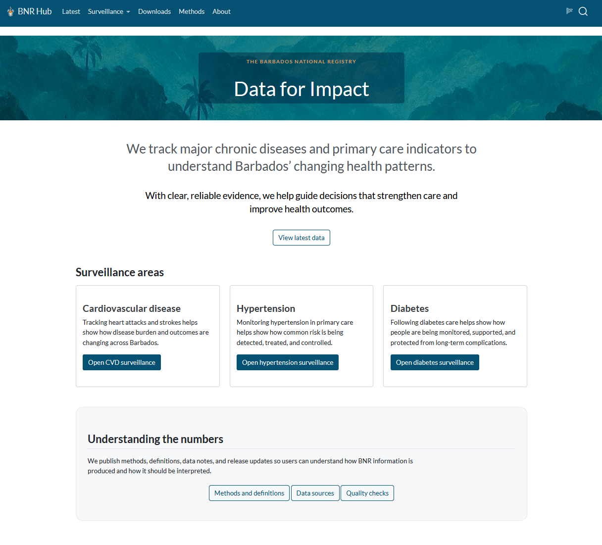
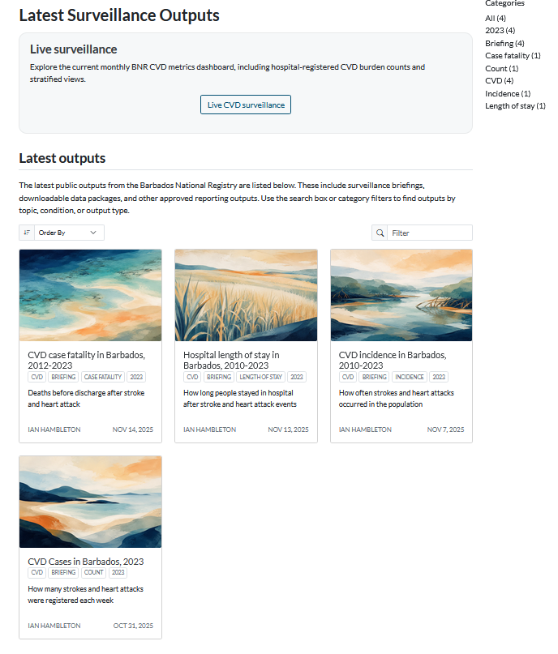
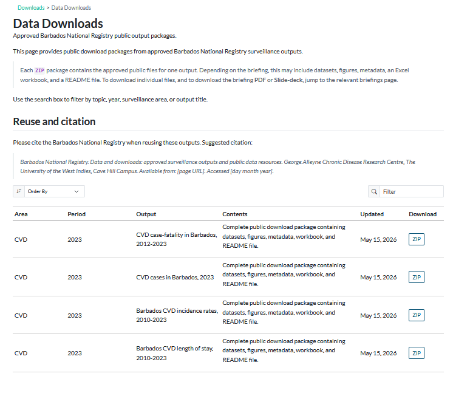
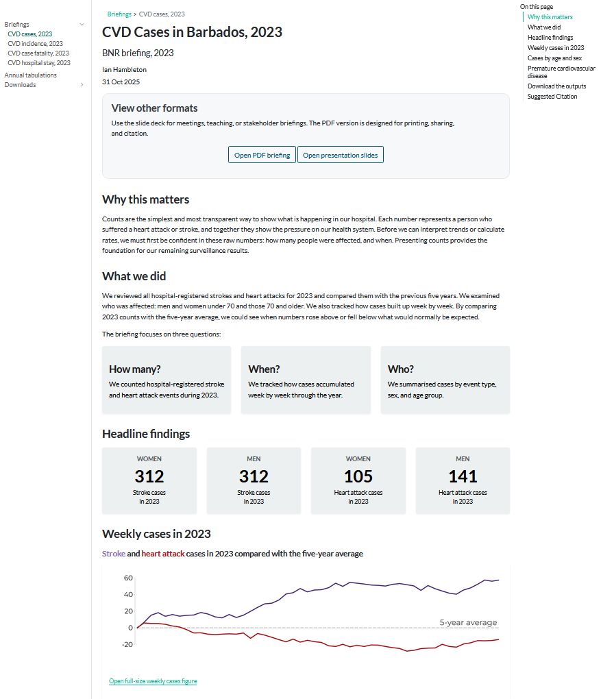
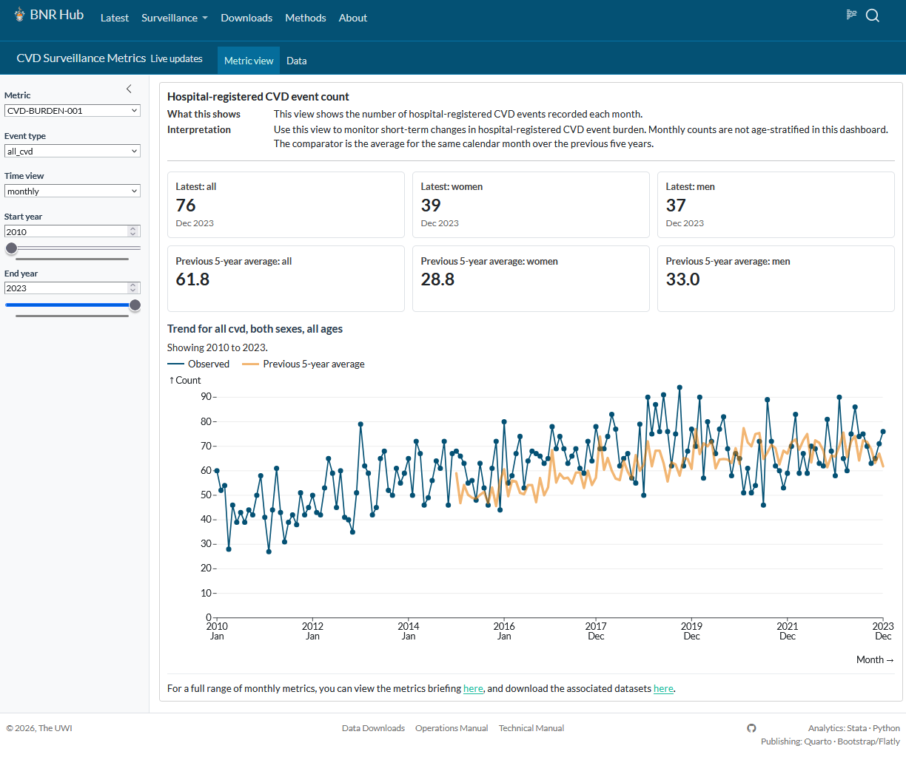

## BNR Hub

### From static documentation to reproducible surveillance reporting

::: {.blue-box}
A short internal tour of the new Quarto-based information hub.
:::

::: {.small .muted}
What the new site does, why it is structured this way, and how the main folders work together.
:::

## Why move from first website to Quarto?

::: {.columns}
::: {.column width="50%"}

### The first site was useful

- Good for documentation
- Good for early content testing
- Good for a first public-facing structure

:::

::: {.column width="50%"}

### Quarto gives more headroom

- Websites, reports, dashboards, slides, and PDFs
- Stronger support for data-led publishing
- Better fit for surveillance reporting
- One publication framework for several output types

:::
:::

::: {.sand-box}
This change is a move toward a reproducible reporting framework.
:::

## The information-hub philosophy

::: {.columns}
::: {.column width="42%"}

### The basic contract

1. **Stata computes**
2. **Outputs are written**
3. **Quarto publishes**
4. **GitHub Pages deploys**

:::

::: {.column width="58%"}

```text
Source data 
   |
   v
Stata scripts
   |
   v
Approved outputs + metadata 
   |
   v
Quarto site, briefings, dashboards, downloads
   |
   v
Static public website
```

:::
:::

::: {.sand-box}
The key rule is separation: analytics belongs in the compute layer; presentation belongs in the publish layer.
:::

## Home page and public entry points

::: {.columns}
::: {.column width="62%"}

{.screenshot fig-alt="BNR Hub landing page showing hero banner, surveillance areas, and methods links" width="100%"}

:::

::: {.column width="38%"}

### What the home page does

- Sets the public identity: **Data for Impact**
- Introduces the surveillance areas
- Routes users to CVD, hypertension, and diabetes
- Points users toward methods, data sources, and quality checks

::: {.sand-box .small} 
Landing page designed to help users find public surveillance outputs easily.
:::

:::
:::

## Latest outputs and downloads

::: {.columns}
::: {.column width="52%"}

{.screenshot-wide fig-alt="Latest surveillance outputs listing with briefing cards" width="100%"}

:::

::: {.column width="48%"}

{.screenshot-wide fig-alt="Data downloads page showing approved ZIP packages" width="100%"}

:::
:::

::: {.sand-box}
The site separates **discovery** from **download**. Users can browse latest outputs as cards, then download approved public packages from the downloads table.
:::

## Briefing pages

::: {.columns}
::: {.column width="62%"}

{.screenshot fig-alt="CVD cases briefing page showing format buttons, headline findings, and chart" width="100%"}

:::

::: {.column width="38%"}

### One briefing, several products

- HTML briefing for web reading
- PDF briefing for printing and citation
- reveal.js slides for meetings and teaching
- ZIP package for approved public data files
- Figures, datasets, metadata, workbook, and README

::: {.sand-box .small}
Each briefing is a public interpretation of a defined analytical output package.
:::

:::
:::

## Dashboard structure

::: {.columns}
::: {.column width="64%"}

{.screenshot fig-alt="CVD surveillance metrics dashboard showing filters, cards, and monthly chart" width="100%"}

:::

::: {.column width="36%"}

### What the dashboard adds

- Always uses the latest data release
- Defined Indicators (See Methods)
- Indicator selector
- Event type selector
- Date range controls
- Headline cards for latest values
- Chart for observed values and comparator

::: {.sand-box .small}
The dashboard is static and public-facing. It does not call live databases or expose confidential data.
:::

:::
:::

## Repository structure: the big picture {auto-animate="true"}
::: {.sand-box}
The structure reflects the workflow: compute first, approve outputs, then publish.
:::

### 

```text
info-hub/
│
├─ scripts/
│  ├─ stata/
│  ├─ python/
│  └─ powershell/
```

## Repository structure: the big picture {auto-animate="true"}
::: {.sand-box}
The structure reflects the workflow: compute first, approve outputs, then publish.
:::

### 

```text
info-hub/
│
├─ scripts/
│  ├─ stata/
│  ├─ python/
│  └─ powershell/
│
├─ outputs/
│  ├─ staging/
│  └─ public/
```


## Repository structure: the big picture {auto-animate="true"}
::: {.sand-box}
The structure reflects the workflow: compute first, approve outputs, then publish.
:::

### 

```text
info-hub/
│
├─ scripts/
│  ├─ stata/
│  ├─ python/
│  └─ powershell/
│
├─ outputs/
│  ├─ staging/
│  └─ public/
│
├─ site/
│  ├─ surveillance/
│  ├─ downloads/
│  ├─ methods/
│  ├─ operations/
│  ├─ technical/
│  ├─ assets/
│  └─ internal/
```

## Repository structure: the big picture {auto-animate="true"}
::: {.sand-box}
The structure reflects the workflow: compute first, approve outputs, then publish.
:::

### 

```text
info-hub/
│
├─ scripts/
│  ├─ stata/
│  ├─ python/
│  └─ powershell/
│
├─ outputs/
│  ├─ staging/
│  └─ public/
│
├─ site/
│  ├─ surveillance/
│  ├─ downloads/
│  ├─ methods/
│  ├─ operations/
│  ├─ technical/
│  ├─ assets/
│  └─ internal/
│
└─ .github/
   └─ workflows/
```


## Compute and output folders

::: {.columns}
::: {.column width="48%"}

### `scripts/`

Where the work is done.

```text
scripts/stata/
├─ ado/
├─ briefings/
├─ metrics/
├─ annual/
├─ common/
└─ config/
```

- Stata is the primary analytics engine
- Briefing and indicator DO files produce defined outputs
- ADO files hold reusable helpers

:::

::: {.column width="48%"}

### `outputs/`

Where machine-generated products land.

```text
outputs/
├─ staging/
│  ├─ briefings/
│  └─ metrics/
│
└─ public/
   ├─ briefings/
   └─ metrics/
```

- `staging/` supports checking
- `public/` holds approved outputs
- Generated outputs are not manually edited

:::
:::

## Publication and download folders

::: {.columns}
::: {.column width="48%"}

### `site/`

Where Quarto publishes.

```text
site/
├─ surveillance/
├─ downloads/
├─ methods/
├─ operations/
├─ technical/
├─ assets/
└─ internal/
```

- Public pages live here
- Internal pages can be rendered but left unlisted
- Shared assets, images, etc sit under `assets/` or local page folders

:::

::: {.column width="48%"}

### `site/downloads/`

Where public files are exposed.

```text
site/downloads/
├─ index.qmd
├─ downloads.yml
└─ files/
   ├─ briefings/
   └─ metrics/
```

- The downloads page lists approved packages
- ZIP packages are the public download route
- Briefing pages can link to individual PDFs and slide decks

:::
:::

::: {.sand-box}
All analytics performed locally before upload. The website then describes and exposes approved products. 
:::

## What this gives BNR

::: {.columns}
::: {.column width="50%"}

### For public users

- Clear surveillance entry points
- Narrative briefings
- Downloadable data packages
- Methods and interpretation pages
- Simple dashboards for live-style monitoring

:::

::: {.column width="50%"}

### For the BNR team

- Reproducible Stata workflows
- Standard output folders
- Metadata and release discipline
- Static web deployment
- A structure that can grow to hypertension and diabetes

:::
:::

::: {.sand-box}
The long-term aim is not a clever website. It is a maintainable surveillance system that a small team can run, check, explain, and hand over.
:::
