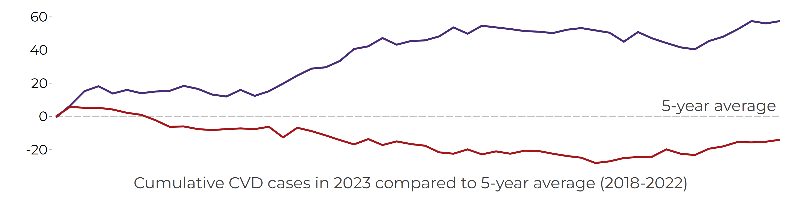
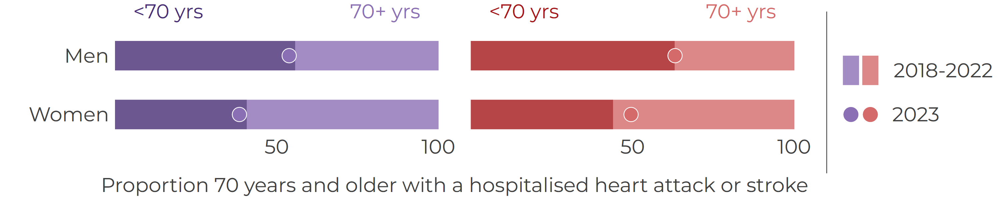

# Hospital Cardiovascular Cases in Barbados

**BNR CVD case-count briefing, 2023**

Briefing created by the Barbados National Registry, The University of the West Indies.

## Key messages

- In 2023, BNR recorded 312 strokes in women and 312 strokes in men.
- BNR recorded 105 heart attacks in women and 141 heart attacks in men.
- Stroke cases remained above the recent five-year average through much of the year.
- A substantial share of cardiovascular events occurred before age 70.

## Why this matters

Counts are the foundation of surveillance. Before rates, trends, models, or dashboards can be interpreted, the basic number of hospital-registered events must be clear.

## What we did

We reviewed hospital-registered strokes and heart attacks for 2023 and compared them with the average pattern from 2018 to 2022.

## Cumulative weekly cases

{width=100%}

## Cases by age, sex, and event type

{width=100%}

## Interpretation

The 2023 case-count pattern shows a contrast between stroke and heart attack activity. Stroke cases were consistently higher than the recent five-year average, while heart attack cases were lower for much of the year.

This difference may reflect changes in disease occurrence, health-seeking behaviour, recognition of emergency symptoms, hospital presentation patterns, or post-pandemic service use. Counts alone cannot explain why the pattern changed, but they provide a clear early signal for further investigation.

## Outputs

Tables, figure data, metadata, and build records are available in the online briefing.

## Citation

Barbados National Registry. *Hospital Cardiovascular Cases in Barbados: BNR CVD case-count briefing, 2023*. Barbados National Chronic Disease Registry, The University of the West Indies.