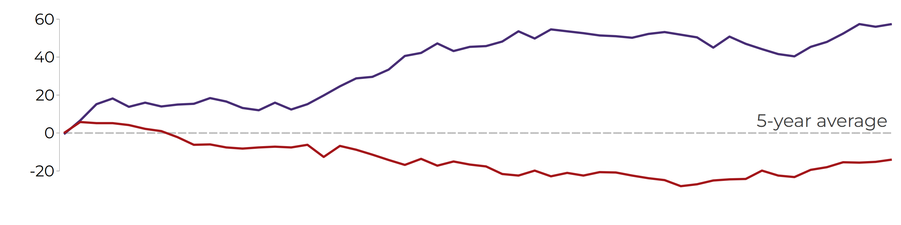
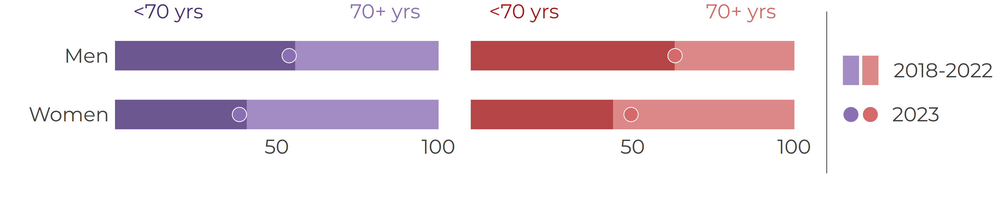

::: {.bnr-utility-card .bnr-briefing-action-card .my-3}

### View other formats

Use the slide deck for meetings, teaching, or stakeholder briefings. The PDF version is designed for printing, sharing, and citation.

::: {.bnr-utility-links}
[Open PDF briefing](pdf/bnr_cvd_cases_2023_v1.pdf){.btn .btn-outline-primary target="_blank" rel="noopener"}
[Open presentation slides](slides/bnr_cvd_cases_2023_v1_slides.html){.btn .btn-outline-primary target="_blank" rel="noopener"}
:::

:::





The briefing focuses on three questions:

::: {.grid}

::: {.g-col-12 .g-col-md-4}
::: {.card .border-0 .shadow-sm .h-100 .bg-light}
::: {.card-body}

### How many?

We counted hospital-registered stroke and heart attack events during 2023.

:::
:::
:::

::: {.g-col-12 .g-col-md-4}
::: {.card .border-0 .shadow-sm .h-100 .bg-light}
::: {.card-body}

### When?

We tracked how cases accumulated week by week through the year.

:::
:::
:::

::: {.g-col-12 .g-col-md-4}
::: {.card .border-0 .shadow-sm .h-100 .bg-light}
::: {.card-body}

### Who?

We summarised cases by event type, sex, and age group.

:::
:::
:::

:::


## Headline findings

::: {.grid .mb-4}

::: {.g-col-6 .g-col-md-3}
::: {.card .border-0 .shadow-sm .h-100 .bg-light}
::: {.card-body .text-center .p-3}

<p class="text-uppercase fw-semibold small text-muted mb-1">Women</p>
<p class="display-6 fw-semibold mb-1">312</p>
<p class="mb-0 small">Stroke cases<br>in 2023</p>

:::
:::
:::

::: {.g-col-6 .g-col-md-3}
::: {.card .border-0 .shadow-sm .h-100 .bg-light}
::: {.card-body .text-center .p-3}

<p class="text-uppercase fw-semibold small text-muted mb-1">Men</p>
<p class="display-6 fw-semibold mb-1">312</p>
<p class="mb-0 small">Stroke cases<br>in 2023</p>

:::
:::
:::

::: {.g-col-6 .g-col-md-3}
::: {.card .border-0 .shadow-sm .h-100 .bg-light}
::: {.card-body .text-center .p-3}

<p class="text-uppercase fw-semibold small text-muted mb-1">Women</p>
<p class="display-6 fw-semibold mb-1">105</p>
<p class="mb-0 small">Heart attack cases<br>in 2023</p>

:::
:::
:::

::: {.g-col-6 .g-col-md-3}
::: {.card .border-0 .shadow-sm .h-100 .bg-light}
::: {.card-body .text-center .p-3}

<p class="text-uppercase fw-semibold small text-muted mb-1">Men</p>
<p class="display-6 fw-semibold mb-1">141</p>
<p class="mb-0 small">Heart attack cases<br>in 2023</p>

:::
:::
:::

:::


## Weekly cases in 2023

```{=html}
<p class="mt-3 mb-2" style="font-size: 1.15rem; font-weight: 700;">
  <span style="color: rgb(139, 111, 180);">Stroke</span>
  and
  <span style="color: rgb(164, 22, 26);">heart attack</span>
  cases in 2023 compared with the five-year average
</p>
```

::: {.card .border-0 .shadow-sm .mb-4}
::: {.card-body}

{fig-alt="Line chart showing cumulative weekly stroke and heart attack cases in 2023 compared with the five-year average for 2018 to 2022." width="100%"}

[Open full-size weekly cases figure](../../../downloads/files/briefings/cvd_cases_2023_v1/figures/cvd_cases_weekly.png){.small target="_blank" rel="noopener"}

:::
:::



## Cases by age and sex

```{=html}
<p class="mt-3 mb-2" style="font-size: 1.15rem; font-weight: 700;">
  Proportion of
  <span style="color: rgb(139, 111, 180);">stroke</span>
  and
  <span style="color: rgb(164, 22, 26);">heart attack</span>
  cases occurring before age 70
</p>
```

::: {.card .border-0 .shadow-sm .mb-4}
::: {.card-body}

{fig-alt="Bar chart showing the proportion of stroke and heart attack cases under age 70 and age 70 or older, by sex." width="100%"}

[Open full-size age distribution figure](../../../downloads/files/briefings/cvd_cases_2023_v1/figures/cvd_cases_age_group.png){.small target="_blank" rel="noopener"}

:::
:::


## Premature cardiovascular disease



## Download the outputs

The briefing outputs are available in three formats.

| Description |  | Download |
|---|:---:|---|
| PDF briefing for reading or printing |  | [Download PDF briefing](pdf/bnr_cvd_cases_2023_v1.pdf){download="bnr_cvd_cases_2023_v1.pdf"} |
| View and use our briefing slide deck |  | [Open briefing slides](slides/bnr_cvd_cases_2023_v1_slides.html){target="_blank" rel="noopener"} |
| Excel workbook with data and metadata worksheets |  | [Download Excel workbook](../../../downloads/files/briefings/cvd_cases_2023_v1/workbook/bnr_cvd_cases_2023_v1.xlsx){download="bnr_cvd_cases_2023_v1.xlsx"} |
| Full public output package, including DTA, CSV, YML, PNG, workbook, and README files |  | [Download ZIP package](../../../downloads/files/briefings/cvd_cases_2023_v1/bnr_cvd_cases_2023_v1.zip){download="bnr_cvd_cases_2023_v1.zip"} |


## Suggested Citation

> Barbados National Registry. *Hospital Cardiovascular Cases in Barbados: BNR CVD case-count briefing, 2023*. Barbados National Chronic Disease Registry, The University of the West Indies. Available at: https://uwi-bnr.github.io/info-hub/surveillance/cvd/briefings/case-counts.html. Accessed: [insert date accessed].