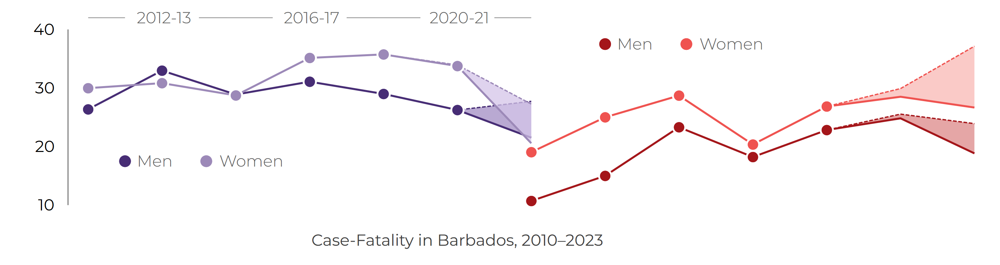

```{=typst}
#let bnr_navy = rgb("#001F3D")
#let bnr_sand = rgb("#D89C60")
#let bnr_grey = rgb("#666666")
#let uwi_logo = "../../../../assets/images/uwi-crestonly-20p.png"
#let body_font = "Noto Sans"
#let heading_font = "Noto Sans"

#block[
  #grid(
    columns: (42pt, 1fr),
    column-gutter: 9pt,
    align(top, image(uwi_logo, height: 38pt)),
    [
      #text(font: heading_font, size: 16pt, weight: "semibold", fill: rgb("#000000"))[CVD Case Fatality in Barbados]
      #linebreak()
      #text(font: body_font, size: 9.4pt, fill: bnr_grey)[Briefing created by the Barbados National Chronic Disease Registry, The University of the West Indies.]
      #linebreak()
      #text(font: body_font, size: 9.4pt, style: "italic", fill: bnr_grey)[Group Contacts • Christina Howitt (BNR lead) • Ian Hambleton (analytics) • Updated on 06 May 2026]
    ]
  )
  #v(5pt)
  #align(center)[
    #text(font: body_font, size: 9.4pt, fill: bnr_grey)[For all our surveillance outputs • https://uwi-bnr.github.io/info-hub/]
  ]
  #v(5pt)
  #line(length: 100%, stroke: (paint: rgb("#555555"), thickness: 0.55pt))
]
#v(8pt)
```





## Key messages

- In 2022-2023, age-adjusted stroke case fatality was about 29% in women and 30% in men.
- In 2022-2023, age-adjusted heart attack case fatality was about 16% in women and 14% in men.
- Before age adjustment, women had higher case fatality than men for both conditions.
- Age explained part - but not all - of the higher case fatality observed among women.

```{=typst}
#v(6pt)
#block(width: 100%)[
  #text(font: "Noto Sans", size: 12.6pt, weight: "semibold")[
    Higher case fatality in women after
    #text(fill: rgb("#A4161A"))[heart attack]
    and
    #text(fill: rgb("#8B6FB4"))[stroke]
  ]
]
#v(3pt)
```

{width=100% fig-alt="Line chart showing case fatality after hospital-registered stroke and heart attack in Barbados by sex."}



```{=typst}
#pagebreak()
```

```{=typst}
#v(6pt)
#block(width: 100%)[
  #text(font: "Noto Sans", size: 12.6pt, weight: "semibold")[
    Older age partly explains the female excess in case fatality
  ]
]
#v(3pt)
```

{width=100% fig-alt="Bar chart showing the age profile of hospital-registered stroke and heart attack events by sex and case-fatality status."}



## Outputs

Tables, figure data, metadata, and build records are available in the online briefing.

## Citation

```{=typst}
#text(font: "Noto Sans", size: 8.4pt, fill: rgb("#666666"))[
  Barbados National Registry. #emph[CVD Case Fatality in Barbados: BNR CVD case-fatality briefing, 2023]. Barbados National Chronic Disease Registry, The University of the West Indies. Available at: #link("https://uwi-bnr.github.io/info-hub/surveillance/cvd/briefings/case-fatality.html")[https://uwi-bnr.github.io/info-hub/surveillance/cvd/briefings/case-fatality.html]. Accessed: [insert date accessed].
]
```
