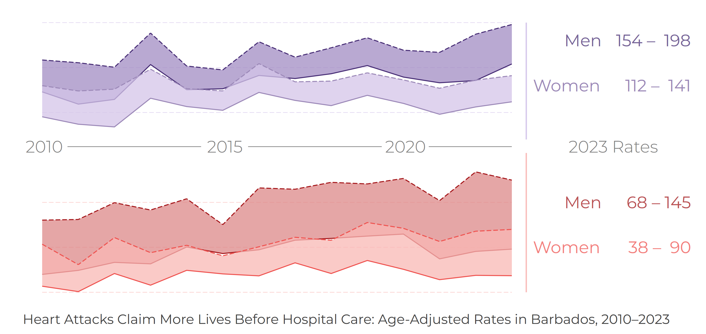
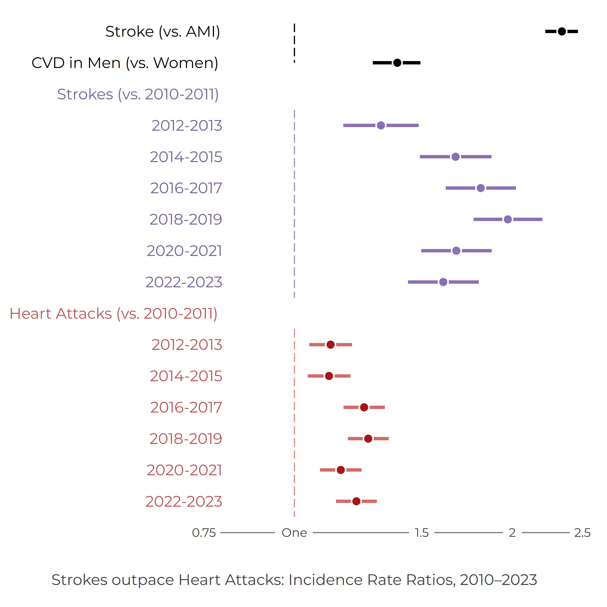

---
format:
  revealjs:
    output-file: bnr_cvd_incidence_2023_v1_slides.html
    theme: simple
    width: 1600
    height: 900
    margin: 0.06
    slide-level: 2
    slide-number: c/t
    transition: fade
    controls: true
    progress: true
    center: false
    logo: ../../../../assets/images/uwi-crestonly-20p.png
    footer: "Barbados National Registry | The University of the West Indies"
    css:
      - ../../../../assets/css/reveal-fonts.css
    include-in-header:
      text: |
        
---

::: {.title-wrap}

::: {}

CVD Incidence in Barbados, 2010-2023

BNR CVD briefing, 2023

::: {.deck-kicker}
Briefing created by the Barbados National Chronic Disease Registry, The University of the West Indies  
Group Contacts - Christina Howitt (BNR lead) - Ian Hambleton (analytics) - Updated on 7 Nov 2025
:::

::: {.deck-rule}
:::
:::
:::

## Key messages

Age-standardised incidence rates per 100,000 population, 2023.

::: {.number-grid}
::: {.number-card}

141

stroke incidence among women

:::

::: {.number-card}

198

stroke incidence among men

:::

::: {.number-card}

90

heart attack incidence among women

:::

::: {.number-card}

145

heart attack incidence among men

:::
:::

::: {.insight-box}
Incidence rates were higher among men for both stroke and heart attack.
:::

## Why this matters

Incidence rates show the rate at which new cardiovascular events are occurring in the population.

- Counts show pressure on services.
- Incidence rates allow fairer comparison over time.
- Including deaths before hospital care gives a fuller view of disease burden.

::: {.insight-box}
For heart attacks, hospital data alone can miss a substantial part of the burden.
:::

## What we did

We estimated annual age-standardised incidence rates for stroke and heart attack in Barbados from 2010 to 2023.

- We examined hospital-registered events.
- We added death-certificate-only events to estimate fuller population burden.
- We compared incidence patterns by event type, sex, and period.

## Annual stroke and heart attack incidence rates, 2010-2023

::: {.columns}
::: {.column width="68%"}
{fig-alt="Annual age-standardised cardiovascular incidence rates from 2010 to 2023."}
:::

::: {.column width="32%"}
### Main pattern

- Stroke incidence was higher than heart attack incidence.
- Men had higher rates than women.
- Death-certificate-only events increased measured incidence, especially for heart attacks.

::: {.figure-note}
Rates are age-standardised per 100,000 population.
:::
:::
:::

## Interpretation

Hospital data and death certificates tell different parts of the incidence story.

Hospital data capture treated events. Death-certificate-only events capture people whose cardiovascular event was recorded as the underlying cause of death but who were not captured as hospital cases.

::: {.insight-box}
Combining both sources gives a more complete view of cardiovascular burden.
:::

## Incidence differences by event type, sex, and period

::: {.columns}
::: {.column width="68%"}
{fig-alt="Rate-ratio figure showing cardiovascular incidence differences by event type, sex, and period."}
:::

::: {.column width="32%"}
### Sex differences

- Men had higher incidence rates across the briefing outputs.
- The male excess was visible for both stroke and heart attack.
- These differences remain important for prevention and service planning.

::: {.figure-note}
Figure source: BNR incidence briefing outputs.
:::
:::
:::

## What this means

The incidence briefing shows continuing cardiovascular burden in Barbados.

The pattern is not only about hospital workload. It also reflects underlying disease risk, care-seeking, emergency response, and deaths occurring before hospital care.

::: {.insight-box}
Routine incidence monitoring helps turn registry data into planning intelligence.
:::

## Outputs and citation

Tables, figure data, metadata, workbook files, and build records are available in the online briefing.

::: {.audience-citation}
Barbados National Registry. *CVD Incidence in Barbados, 2010-2023: BNR CVD briefing, 2023*. Barbados National Chronic Disease Registry, The University of the West Indies. Accessed: [insert date accessed].
:::

::: {.briefing-url-label}
Online briefing
:::

::: {.briefing-url}
[https://uwi-bnr.github.io/info-hub/surveillance/cvd/briefings/case-incidence.html](https://uwi-bnr.github.io/info-hub/surveillance/cvd/briefings/case-incidence.html)
:::