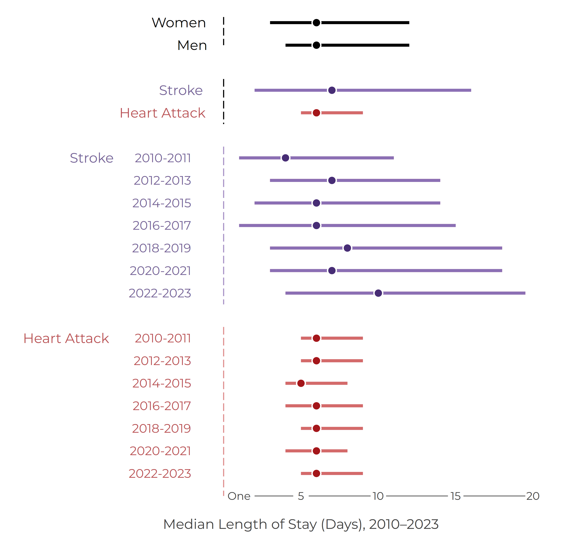
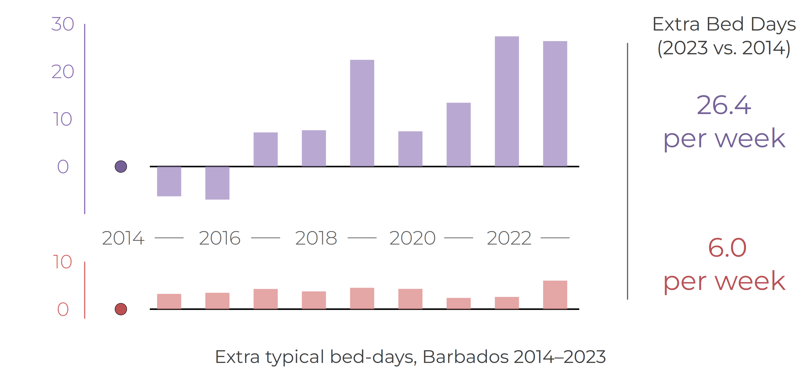

---
format:
  revealjs:
    output-file: bnr_cvd_los_2023_v1_slides.html
    theme: simple
    width: 1600
    height: 900
    margin: 0.06
    slide-level: 2
    slide-number: c/t
    transition: fade
    controls: true
    progress: true
    center: false
    logo: ../../../../assets/images/uwi-crestonly-20p.png
    footer: "Barbados National Registry | The University of the West Indies"
    css:
      - ../../../../assets/css/reveal-fonts.css
    include-in-header:
      text: |
        
---

::: {.title-wrap}

::: {}

Hospital Length of Stay in Barbados, 2010-2023

BNR CVD briefing, 2023

::: {.deck-kicker}
Briefing created by the Barbados National Chronic Disease Registry, The University of the West Indies  
Group Contacts - Christina Howitt (BNR lead) - Ian Hambleton (analytics) - Updated on 13 Nov 2025
:::

::: {.deck-rule}
:::
:::
:::

## Headline findings

Length of stay turns CVD surveillance data into service-planning intelligence: it shows not only how many patients were admitted, but how long hospital beds were typically occupied.

::: {.number-grid}
::: {.number-card}

10 days

<strong>Stroke, 2022-2023</strong> median hospital stay

:::

::: {.number-card}

6 days

<strong>AMI, 2022-2023</strong> median hospital stay

:::

::: {.number-card}

1,372

<strong>Stroke, 2023</strong> extra typical bed-days vs 2014

:::

::: {.number-card}

1,684

<strong>Stroke + AMI, 2023</strong> extra typical bed-days vs 2014

:::
:::

::: {.insight-box}
In 2022-2023, the typical hospital stay after stroke was longer than after AMI. Stroke also accounted for most of the additional typical bed-day pressure in 2023, compared with the 2014 baseline.
:::

## Why this matters

Length of stay is a practical hospital burden measure.

- It reflects patient severity and discharge pathways.
- It affects bed occupancy and ward flow.
- It helps translate registry outputs into planning intelligence.

::: {.insight-box}
Counts tell us how many patients arrive. Length of stay helps show how long those patients occupy hospital capacity.
:::

## What we did

We examined hospital length of stay for CVD events in Barbados from 2010 to 2023.

- We focused on hospital-ascertained stroke and heart attack events.
- We summarised typical stay using the median and interquartile range.
- We estimated extra typical bed-days compared with a 2014 baseline.

## Median length of stay after stroke and heart attack

::: {.columns}
::: {.column width="68%"}
{fig-alt="Median length of hospital stay for stroke and heart attack events in Barbados from 2010 to 2023."}
:::

::: {.column width="32%"}
### Main pattern

- Median length of stay gives a robust summary of typical hospital use.
- The figure separates patterns by event type, sex, and period.
- Long stays are important, but the median avoids domination by rare extreme values.

::: {.figure-note}
Figure source: BNR length-of-stay briefing outputs.
:::
:::
:::

## Interpretation

Length of stay should be read as both a clinical and operational signal.

It is influenced by case severity, rehabilitation needs, discharge pathways, step-down care, and available community support.

::: {.insight-box}
A registry length-of-stay indicator is most useful when interpreted alongside hospital operations knowledge.
:::

## Extra typical bed-days, 2014-2023

::: {.columns}
::: {.column width="68%"}
{fig-alt="Extra typical bed-days for stroke and heart attack events in Barbados from 2014 to 2023."}
:::

::: {.column width="32%"}
### Planning interpretation

- Extra typical bed-days combine change in typical stay with case volume.
- This converts surveillance findings into a capacity-relevant measure.
- It can support discussion about discharge planning, rehabilitation, and step-down care.

::: {.figure-note}
Extra typical bed-days are calculated against a 2014 baseline.
:::
:::
:::

## What this means

The length-of-stay briefing extends CVD surveillance beyond event counts.

It shows how cardiovascular events translate into hospital resource use and helps identify where registry data can support planning conversations.

::: {.insight-box}
Length of stay is not just a clinical outcome. It is also a system-pressure indicator.
:::

## Outputs and citation

Tables, figure data, metadata, workbook files, and build records are available in the online briefing.

::: {.audience-citation}
Barbados National Registry. *Hospital length of stay in Barbados, 2010-2023: BNR CVD briefing, 2023*. Barbados National Chronic Disease Registry, The University of the West Indies. Accessed: [insert date accessed].
:::

::: {.briefing-url-label}
Online briefing
:::

::: {.briefing-url}
[https://uwi-bnr.github.io/info-hub/surveillance/cvd/briefings/hospital-los.html](https://uwi-bnr.github.io/info-hub/surveillance/cvd/briefings/hospital-los.html)
:::
